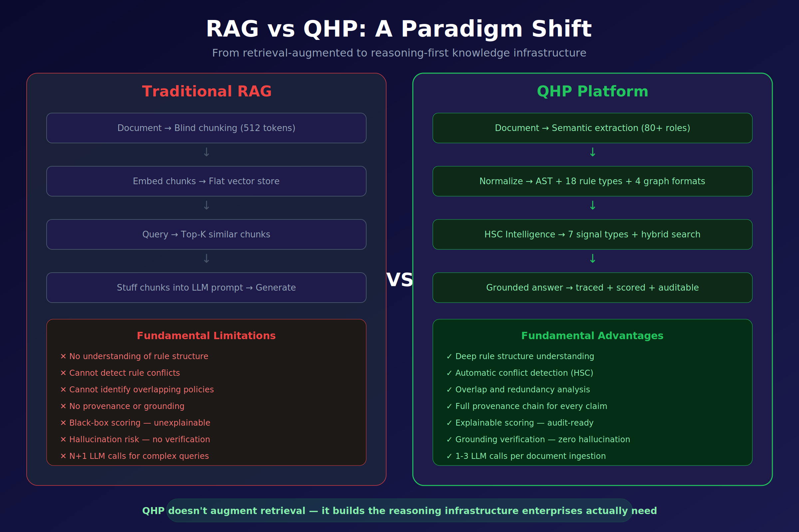
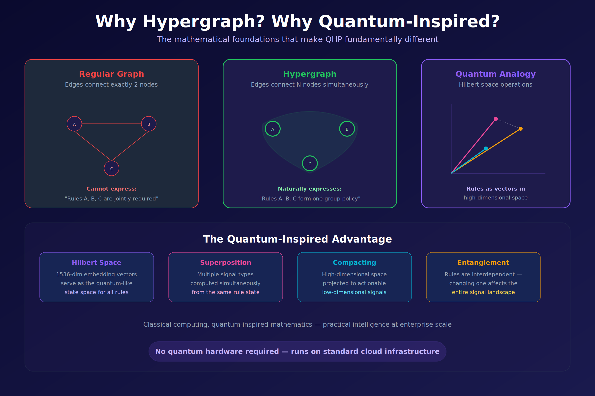
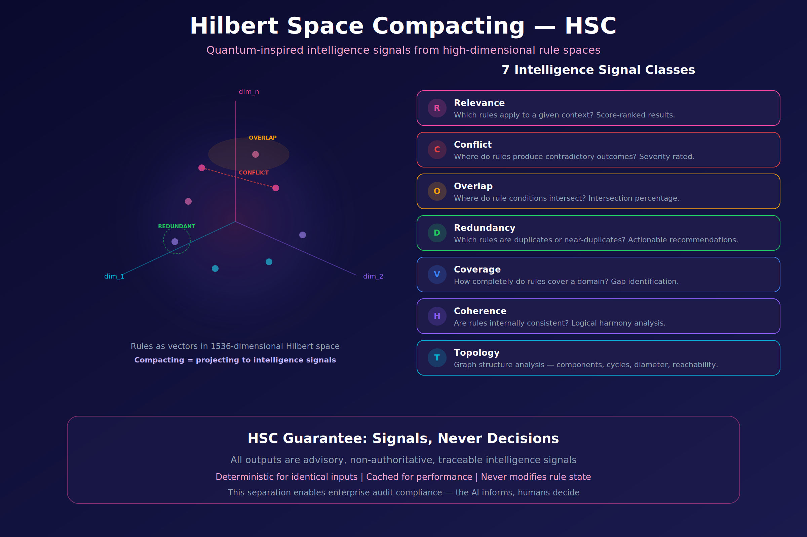

# Introduction: the retrieval assumption fails in regulated domains

The last generation of knowledge-grounded AI systems converged on a common
shape. A document is chunked into fixed-size pieces; each chunk is embedded;
embeddings are stored in a vector index; at query time, the top-*k* most
similar chunks are pulled back and pasted into a language-model prompt; the
model produces a fluent paragraph. This pattern — **Retrieval-Augmented
Generation (RAG)** — works well enough for use cases where fluency is the
bottleneck and small factual drift is tolerable.

It fails, reliably and in public, for the documents that regulated
enterprises actually run on.

A regulation is not a paragraph. It is a *rule set*. Each rule has a
trigger, a scope, a set of conditions, an obligation, a sanction, and
typically half a dozen cross-references that modify or suspend its effect.
Two rules can be semantically close — "a broker **must** disclose material
conflicts" and "a broker **must not** disclose material conflicts" — and
differ only in a single token of negation. A cosine-similarity retriever
sees them as near-duplicates. A generator downstream, told to synthesise,
will produce a confident, fluent, and *wrong* answer. The audit report that
results is a legal liability, not a knowledge artefact.

This paper makes three claims, in order:

1. **The failure is architectural, not a tuning problem.** RAG cannot be
   repaired by bigger models, better chunkers, or larger context windows.
   The primitive of *retrieve-then-stuff* is the wrong primitive for
   rule-bearing documents.

2. **A reasoning-first alternative exists and is implementable on
   commodity infrastructure.** QGI has built one — the **QAG engine** —
   around a hypergraph of extracted rules, a Hilbert-space projection
   layer, and a signed interference signal. No quantum hardware is
   required.

3. **The embedding model is load-bearing.** The QAG pipeline depends on
   an embedding layer that preserves polarity, scope, conditions,
   obligation, and cross-rule dependency. General-purpose embeddings do
   not preserve any of these reliably. A purpose-built model — **Q-Prime**
   — is therefore not an optimisation. It is a structural requirement.

The first two claims form the body of this paper. The third claim is the
argument we develop in §[Q-Prime-argument].

# The QAG engine in one picture

{width=100%}

Figure 1 frames the contrast at the highest level. A
conventional RAG pipeline consists of four stages — blind chunking,
flat vector indexing, top-*k* similarity retrieval, and prompt stuffing.
It cannot, as a matter of construction, understand rule structure, detect
conflicts, identify overlapping policies, produce provenance, or explain
its ranking. Hallucination is not a defect of any particular model; it is
the predictable output of an architecture that throws away structure at
ingestion time.

The QAG engine replaces every stage. Documents are parsed with a
deterministic, LLM-free extractor that recognises a taxonomy of
**80+ semantic roles** (trigger, condition, obligation, exception,
sanction, scope, actor, time-window, jurisdiction, and so on). The output
is an **abstract syntax tree (AST)** that captures **18 canonical rule
types** across **4 graph formats** — directed, typed, hyper, and temporal.
The graph is immutable and versioned.

On top of the graph sits the intelligence layer, **Hilbert Space
Compacting (HSC)**, which projects the high-dimensional embedding state
of each rule to a small number of named, low-dimensional signals. Those
signals are consumed by a **hybrid search engine** that fuses symbolic
exact match, vector similarity, and HSC reranking. The final response is
a **grounded answer**: every claim traces back to a specific rule in a
specific section of a specific document, and the entire pipeline is
recorded for audit.

## A note on naming

The QGI stack carries several overlapping names, which we unify here:

| Name | Meaning |
|---|---|
| **QAG** | *Quantum-Augmented Generation.* The successor category to RAG. The public-facing name of the engine. |
| **QHP** | *Quantum HyperGraph Platform.* The technical realisation of the QAG engine. |
| **QNR2** | The deterministic parser and normaliser (v2). LLM-free, algorithmic, reproducible. |
| **QHG** | *Quantum HyperGraph.* The immutable graph state emitted by QNR2 and consumed by HSC. |
| **HSC** | *Hilbert Space Compacting.* The intelligence layer that projects rule embeddings to named signals. |
| **Q-Prime** | The purpose-built embedding model used by HSC. Subject of §[Q-Prime-argument]. |

Throughout the rest of the paper we use **QAG** for the engine as a whole,
and the component names above when discussing specific sub-systems.

# Why a hypergraph, and why a Hilbert space

{width=100%}

Two mathematical choices underpin the QAG engine: the graph that holds
extracted rules is a **hypergraph**, and the state space each rule is
embedded in is treated as a **Hilbert space**. Figure 2
motivates both.

## Hypergraphs

A standard graph has edges that connect *exactly two* nodes. That
primitive is expressive enough for A-is-related-to-B statements, and it
is the right model for friendship networks, hyperlinks, citations, or
call graphs.

It is the wrong model for policy. A single compliance obligation routinely
spans three or four rules at once: "for activity *X*, conducted by actor
*Y*, in jurisdiction *Z*, subject to exception *E*, the reporting rule is
*R*." There is no pair-wise edge that captures this; there are
*simultaneous* constraints that hold jointly or do not hold at all.

A **hypergraph** permits an edge — a *hyperedge* — to connect any number
of nodes. A policy becomes a single hyperedge over the rules it
co-activates. Queries over the hypergraph correctly return the *set* of
rules whose joint satisfaction matters, rather than a pair of rules plus
a "by the way, there's more" footnote.

## Hilbert space, without quantum hardware

The Hilbert-space framing is similarly practical. A **Hilbert space** is a
vector space with an inner product — precisely the structure that makes
notions like *angle*, *projection*, and *interference* well-defined. A
general-purpose embedding model already outputs vectors in such a space;
what QAG adds is the observation that the *operations* natural to
Hilbert spaces — superposition (linear combination), projection onto
sub-spaces, and signed interference — are also the operations natural
to compliance reasoning:

- **Superposition** — a single rule frequently asserts several things at
  once (an obligation *and* an exception *and* a sanction). Its vector is
  a linear combination of those component states.
- **Projection** — asking "does this rule conflict with rule *R*'?" is,
  formally, projecting the joint state onto the subspace of
  contradiction-bearing states.
- **Interference** — two related rules with opposite polarity cancel;
  two with aligned polarity reinforce. The *sign* of their inner product
  is meaningful.

No quantum hardware is involved. QAG runs on standard cloud compute. The
word *quantum* denotes a mathematical structure — the Hilbert space and
its operators — not a hardware substrate. QGI's stack uses classical
compute with quantum-inspired mathematics, in the same lineage as
tensor-network methods, quantum probability, and quantum-inspired
sampling.

## The four architectural pillars

The bottom panel of Figure 2 names the four pillars that
follow directly from these choices:

| Pillar | Meaning |
|---|---|
| **Hilbert space** | Rules live as vectors in a high-dimensional state space (nominally 1536-dim in the reference configuration). |
| **Superposition** | Multiple signal types are computed simultaneously from the same rule state, rather than requiring separate passes. |
| **Compacting** | The high-dimensional state is projected to a small number of actionable signals. |
| **Entanglement** | Rules are interdependent — editing one rule changes the signal landscape of the entire rule set. |

Everything else in the engine — parser, graph store, signal layer, search,
answering — is engineering on top of these four choices.

# Hilbert Space Compacting (HSC)

{width=100%}

Figure 3 makes the HSC operation concrete. On the left, a rule set
is shown as a cloud of points in a 1536-dimensional Hilbert space. Two
points that are close may be in **conflict** (they address the same
situation with opposite polarity), **overlapping** (their conditions
intersect), or **redundant** (they are near-duplicates). Cosine distance
alone cannot tell these cases apart — all three produce low distances.

*Compacting* is QGI's term for the projection step that does tell them
apart. Each named signal is defined as the projection of the joint rule
state onto a specific subspace — conflict, overlap, redundancy, coverage,
coherence, topology, or plain relevance — and the coefficient of that
projection is the signal value.

## The HSC guarantee

HSC outputs are **signals, not decisions**. This is a deliberate
architectural choice, enforced by the system's interface contract:

- Every HSC output is **advisory** — no HSC value ever modifies a rule,
  a graph edge, or a stored answer.
- Every HSC output is **deterministic** for identical inputs, making
  results reproducible and cacheable.
- Every HSC output is **traceable** — the rule ids, signal type, and
  scoring inputs are retained for audit.

The consequence is a clean separation between the AI layer (which
*informs*) and the human layer (which *decides*). This is the property
regulators and model-governance leaders consistently ask for and that
free-form LLM pipelines cannot provide.

# The seven intelligence signals

HSC defines seven named signal classes. Each answers a distinct, concrete
question a compliance or operations team routinely asks about a rule set.

| | Signal | Question it answers | Output shape |
|---|---|---|---|
| **R** | Relevance | Which rules apply to a given context? | Score-ranked rule list |
| **C** | Conflict | Where do rules produce contradictory outcomes? | Pairs + severity |
| **O** | Overlap | Where do rule conditions intersect? | Pairs + intersection percentage |
| **D** | Redundancy | Which rules are duplicates or near-duplicates? | Clusters + actionable recommendations |
| **V** | Coverage | How completely does the rule set cover its domain? | Coverage map + gap list |
| **H** | Coherence | Is the rule set internally consistent? | Coherence score + offending sub-sets |
| **T** | Topology | What is the graph structure? | Components, cycles, diameter, reachability |

Two observations on the design:

**Each signal is an answer type, not a metric.** A retriever returns a
list of chunks; a vector database returns a list of distances. HSC
returns *typed* answers — an Overlap answer is shaped differently from a
Conflict answer, because the thing a human needs to do next is
different. Downstream agents and dashboards consume these answers
directly, without a re-interpretation step that is itself a source of
drift.

**Signals are cheap to recompute, costly to fake.** Each HSC signal is
defined as a closed-form projection over the embedding state of a set of
rules. Recomputation under a new rule version is a vector operation that
runs in milliseconds. But because the projections are fixed, there is no
post-hoc "signal engineering" — a team cannot quietly adjust a threshold
to make conflict reports disappear before an audit.

The seven-signal taxonomy is intentionally finite. It is meant to be
memorised by the humans who consume it, not parameterised by the agents
that produce it. Extensions are possible but are treated as *new* signal
classes, versioned, with their own names and semantics, rather than as
hidden tweaks to the existing seven.

# Hybrid search

{width=100%}

Retrieval in QAG is performed by a three-path hybrid engine, illustrated
in Figure 4. Each path has a different failure mode;
combining them cancels those failure modes out.

**Path 1 — Symbolic search.** The query is resolved against exact fields
on the rule AST: role (`Obligation`, `Exception`, `Trigger`, ...),
section metadata, literal token predicates (`rule_text LIKE
'%termination%'`). Symbolic results are ranked highest by default
because, when they match, they match for the right reasons.

**Path 2 — Vector search.** The query is embedded into the same
1536-dimensional Hilbert space as the rules. Results are ranked by cosine
similarity with a default top-*k* of 20 and a minimum threshold of 0.7.
Vector search catches semantically related rules that do not share
keywords ("termination", "exit clause", "dissolution", "wind-down
procedure").

**Path 3 — HSC signal boost.** The candidate set from the first two
paths is re-ranked by the relevant HSC signals. Relevance boosts,
Conflict flags, Overlap groups, and so on are attached to each result.
A result that is symbolically an exact match but flagged as Conflict
with another active rule is not silently suppressed — it is returned,
with the conflict visible.

The three paths fuse into a single score:

$$
\text{combined} \;=\; w_{\text{sym}} \cdot \text{sym} \;+\; w_{\text{vec}} \cdot \text{vec} \;+\; \text{hsc\_boost}
$$

Results are de-duplicated by `rule_id`, attached to their provenance
(source document, section path, rule type, conflict flags), and returned
as a fully explainable ranked list. Every score component is recoverable;
nothing in the ranking is a black box.

# Trust, determinism, and the audit trail

{width=100%}

The engineering properties that separate QAG from generative-first
pipelines are summarised in Figure 5 as five layers:

1. **Deterministic parsing (QNR2).** Ingestion is performed by an
   algorithmic parser, not an LLM. The same input produces the same AST
   every time. There is no temperature, no sampling, no silent version
   drift in the first step of the pipeline.

2. **Immutable graph state (QHG).** Once a hypergraph is built, it is
   not mutated. Updates produce a new version. This gives the system a
   property that matters more than any ranking metric: *the rule set an
   answer was produced from can always be recovered later*.

3. **Advisory-only intelligence (HSC).** Signal outputs never modify
   rule state. The AI informs; the human decides. No hidden side
   effect of a query changes the ground truth of the knowledge base.

4. **Source-grounded answers.** Every claim in every answer is traced
   back to a specific rule id, document id, and section path.
   Ungrounded claims are not produced. Hallucination is not mitigated
   after the fact — it is prevented by construction.

5. **Full trace chain.** Every pipeline step is recorded: intent → slots
   → query → candidate set → HSC signals → answer → grounding →
   confidence. The trace is stored with the answer and replayable.

The composition is summarised by the trust equation printed at the bottom
of the figure:

$$
\text{Trust} \;=\; \text{Determinism} \;+\; \text{Traceability} \;+\; \text{Human authority}
$$

None of the three terms is optional. Remove determinism and reproducibility
dies. Remove traceability and audit dies. Remove human authority and
accountability dies. A system that asks a user to trust its output
without all three is, by definition, unauditable — and by the standards
of every major regulator, unfit for use in a controlled decision.

# Enterprise applications

{width=100%}

Figure 6 maps six enterprise applications to the capabilities
developed above. They are not six separate products; they are six
slices of the same pipeline (ingest → normalise → graph → signal →
search → answer) specialised to different document classes.

- **Regulatory compliance.** Ingest thousands of regulations and
  internal policies. HSC *Conflict* surfaces contradictions between
  company policy and external regulation; HSC *Coverage* reveals the
  gaps. Every finding is audit-trail-ready. Typical domains: SOX, HIPAA,
  FERC, Basel III, MiFID II.

- **Contract intelligence.** Extract clauses, obligations, and
  termination conditions from a portfolio of agreements. *Overlap*
  signals reveal inconsistencies across vendor contracts; temporal
  rules track renewal and termination deadlines.

- **AI agent grounding.** Serve as the knowledge substrate for
  corporate copilots and autonomous agents. Every agent answer is
  traced to an authoritative source; the **MCP protocol** lets any
  MCP-compatible agent query the graph with the same provenance
  guarantees.

- **Policy management.** Detect redundant, conflicting, or outdated
  internal rules at scale. In reference deployments, HSC *Redundancy*
  recommendations reduce policy bloat by **40–60 %** on first pass.

- **Knowledge operations.** Convert tribal knowledge into a
  graph-connected asset. Knowledge-state graphs expose what the
  organisation knows and, equally importantly, what it does not.

- **Due diligence.** Ingest entire data rooms in hours rather than
  weeks. *Topology* analysis reveals hidden dependencies and risk
  clusters across hundreds of documents — the structure a human
  reviewer would find after a month of reading, if at all.

All six sit on the same engine. Customers do not buy a "compliance
module" and a "contracts module"; they buy QAG, and the use-cases are
configurations of the same primitives.

# The case for Q-Prime {#Q-Prime-argument}

We now come to the third claim of this paper. Everything in §2–§7 assumes
an embedding layer that correctly preserves the parameters HSC projects
out — polarity, scope, conditions, obligation, and cross-rule dependency.
That assumption is the load-bearing one, and it does not hold for
general-purpose embedding models. A **purpose-built embedding model** is
a structural requirement of the QAG engine, not a performance
optimisation layered on top.

We develop the argument in four steps: the requirements QAG imposes on
its embedding layer (§8.1); why existing embedding models fail those
requirements (§8.2); what Q-Prime does differently (§8.3); and the
headline empirical result (§8.4).

## What QAG requires of an embedding layer

The HSC projection operation assumes that the underlying embedding space
separably encodes a specific list of features. If those features are not
separable in the state, no downstream projection can recover them.
Concretely, the embedding layer must support the following operations:

1. **Polarity as a first-class parameter.** "Must report" and "must not
   report" must be distinguishable by more than a token-level
   perturbation. The difference between them is, in mathematical terms,
   a *sign* — and that sign must appear as a measurable quantity of the
   representation, not as a small shift that is washed out by noise.

2. **Scope and quantifier sensitivity.** "All *X*", "any *X*", "some
   *X*", and "no *X*" must be separable. Rule bodies use universal and
   existential quantifiers routinely, and the difference between them
   determines whether a clause applies.

3. **Structured conditions.** Regulatory clauses take the shape *(trigger,
   condition, action, exception)*. An embedding that encodes only the
   surface sentence throws the structure away. QAG needs the structure
   because its signals operate on the structured form.

4. **Obligation strength.** "*Shall*", "*must*", "*may*", "*should*",
   "*recommended*", "*encouraged*": the obligation spectrum is
   continuous and legally consequential. Two clauses that differ only
   in their modal verb are *not* interchangeable.

5. **Cross-rule correlation (entanglement).** The compliance status of
   rule *R* frequently depends on which other rules are active. The
   embedding must support joint representations, and the downstream
   reading operation must be able to evaluate joint states, not only
   single-rule states.

6. **Signed interference.** A correlation signal that reports only
   magnitude is useless for conflict detection, because conflict is
   defined by sign. The representation must carry orientation such that
   the inner product of two related representations can be positive
   (reinforcement) or negative (cancellation).

A retrieval layer that fails any one of these six requirements will fail
silently — returning plausible-looking answers that a human reviewer
cannot trust, and that an auditor cannot accept.

## Why general-purpose embeddings are not enough

General-purpose embedding models are trained to make semantically similar
text map to nearby points. They are extremely good at that task. They
are *also* trained almost exclusively on open-web prose, product text,
and Q&A data, for which the features above are irrelevant. Three
structural limitations follow:

**Negation is a small perturbation.** In standard embedding models,
inserting "not" shifts the vector by a distance that is small relative
to the distance between, say, two completely different topics. Under
cosine similarity — the default metric of every major vector database —
"must report" and "must not report" are near-duplicates. Retrieval
systems therefore merge them.

**Quantifier scope is not encoded.** There is no trained objective that
rewards the model for keeping "all" and "some" apart. They share
context, syntax, and often neighbouring tokens. Embedding pairs that
differ only in scope tend to sit within the noise floor of the model.

**There is no orientation, only magnitude.** Cosine distance is a
symmetric similarity; it has no sign. Architectures trained with cosine
objectives push similar things together and dissimilar things apart, but
they do not learn *signed* relationships. Interference — the central
operation QAG depends on — is therefore not available.

These are not hyperparameter problems. They are properties of the
training objective. Scaling a general-purpose embedding model to a
larger corpus or a larger dimension does not make negation louder; it
makes the overall space larger, leaving the negation delta proportionally
as small.

## What Q-Prime does differently

**Q-Prime** is QGI's purpose-built embedding model for the QAG pipeline.
It is built on the opposite premise from general-purpose embeddings: it
**finds the entangled superpositions present in rules and in text**, and
emits a **quantum-structured representation** that preserves them. The
representation has two properties that matter in practice:

- **It is more compact than a classical embedding of equivalent
  content.** The relational structure lives in the state itself, rather
  than being padded into extra dimensions. Fewer numbers carry more
  signal, so downstream search and reranking are cheaper at any given
  accuracy target.

- **It exposes parameters that cosine similarity cannot see.** Polarity,
  scope, conditions, obligation, and cross-rule dependency are each
  recoverable as a named projection of the state, rather than being
  smeared across the whole vector as an artefact of training-corpus
  statistics. The HSC signals described in §5 are these projections.

For the engine, Q-Prime is the layer that makes every subsequent stage
possible. Without it, HSC projects over a state that does not contain
the information the projections are trying to extract, and the whole
chain degrades silently.

## The headline empirical result

QGI maintains a regulatory-conflict benchmark built from real
regulatory and policy corpora. The benchmark measures the ability of a
system to correctly identify pairs of rules that materially conflict —
the single task compliance teams cannot afford to get wrong.

| Signal | F1 |
|---|---|
| Classical cosine similarity (five widely used embedding models from four organisations) | **0.000** |
| QAG interference signal (Q-Prime + polarity) | **1.000** |

The result is categorical, not incremental. Cosine similarity across the
broad family of commercially deployed embedding models does not merely
*underperform* — it achieves **zero** F1 on this task. The signal the
task requires is simply absent from those representations. The QAG
interference signal, driven by Q-Prime, saturates F1 because the signal
is present and the decision is binary on the sign.

Two caveats are worth stating directly. First, the interference *effect*
— the observation that signed interference separates related
same-polarity and opposite-polarity clauses — replicates across
embedding families, not only Q-Prime. It is a property of the language
of regulation, not of any one model. Q-Prime's role is to make the
effect reliable and to add production-grade latency, throughput, and
operational margin on top. Second, these numbers are drawn from a
held-out benchmark and will be released under evaluation agreement; they
are not marketing claims divorced from methodology.

## Implications

Three implications follow for anyone building in this space.

**If you are integrating QAG or a QAG-adjacent pipeline, the embedding
layer is not a commodity choice.** The default assumption in the current
RAG ecosystem — that any sufficiently large embedding model is
interchangeable with any other — is false for regulated content. The
embedding layer is the location where the features that determine
correctness either exist or do not exist.

**If you are evaluating competing systems, ask for the conflict F1.**
Not recall@k, not nDCG, not BLEU. The quantity that determines whether
a system will embarrass you in front of an auditor is its ability to
tell contradictory clauses apart. Everything else is downstream.

**If you are building your own, budget for the embedding layer.** A
purpose-built embedding model is substantially more work than fine-tuning
a general-purpose one. That is the honest assessment. It is also, in our
experience, the difference between a demo that looks convincing and a
system a regulator accepts.

# Access, license, and roadmap

The QAG engine is released progressively, with **general availability
targeted for 21 June 2026**. Q-Prime is available now, in progressive
beta, through three paths:

- **Evaluation access** — researchers and engineers may request an
  evaluation token at `contact@qgi.dev`. Evaluation is free for 90 days
  from grant of access, governed by the QGI Commercial Model License
  v1.0, §3.
- **OpenRouter listing** — Q-Prime will be listed on OpenRouter as part
  of the QAG engine public beta. Listing status and pricing are
  announced at [qgi.dev](https://qgi.dev).
- **Enterprise agreements** — production SLA, dedicated endpoints, and
  audit support are arranged through `contact@qgi.dev`. Tiers: Startup,
  Growth, Enterprise, OEM / Channel.

Weights are **not distributed**. The model is accessed as a managed
API. Redistribution requires a separately negotiated license.
Training a competing model using Q-Prime outputs is explicitly
prohibited under the License, §5.3. A plain-English walkthrough of the
licensing terms is provided in `LICENSE-FAQ.md` of the public model
card.

The broader QGI stack extends beyond the engine itself:

| Layer | Product | Status |
|---|---|---|
| Model | Q-Prime | Progressive beta via API |
| Engine | QAG (extraction, interference, versioning, audit trail) | GA 21 June 2026 |
| Agent platform | Neural Symbolic Agents — enterprise agent runtime over QAG | Enterprise evaluation |
| Vertical models | Qualtron — mortgage, banking, healthcare, regulated news | Enterprise pilots |

# Conclusion

RAG is not the right primitive for regulated knowledge. The conclusion
is not an indictment of RAG — RAG solved the problem it was built for —
but a recognition that the documents the enterprise runs on encode rule
structure that retrieve-then-stuff throws away.

QAG is QGI's answer. It is built on two mathematical choices —
hypergraphs for joint constraints, Hilbert-space projections for signed
interference — and one engineering discipline: every layer is
deterministic, traceable, and advisory. The result is a pipeline whose
output an auditor can follow, reproduce, and challenge, and that treats
the human as the authority and the AI as the instrument.

The embedding layer is where the whole architecture lives or dies.
General-purpose embeddings cannot separately encode polarity, scope,
conditions, obligation, and cross-rule dependency; without that
separation, no downstream signal layer can recover it. **Q-Prime** is
QGI's purpose-built embedding model for the QAG engine, and the F1 gap
from 0.000 to 1.000 on the regulatory-conflict benchmark is the
strongest evidence we can offer that purpose-built matters here, and
matters a lot.

For an organisation whose audits, compliance posture, or legal exposure
depends on getting rule interpretation right, the question is not
"should I upgrade my embedding model?". It is: "is my embedding model
capable, in principle, of carrying the signal my decisions depend on?"
For regulated knowledge, the honest answer for general-purpose
embeddings is *no*. Q-Prime and the QAG engine are designed to make the
answer *yes*.

# Glossary

- **AST** — Abstract Syntax Tree. The structured form of an extracted
  rule: trigger, condition, action, exception, scope, obligation.
- **HSC** — *Hilbert Space Compacting*. The projection layer that turns
  high-dimensional rule state into named low-dimensional signals.
- **Hypergraph** — A graph whose edges connect any number of nodes
  simultaneously.
- **MCP** — Model Context Protocol. Standard for letting agents query
  external knowledge graphs.
- **QAG** — *Quantum-Augmented Generation*. QGI's successor category to
  RAG.
- **QHG** — *Quantum HyperGraph*. Immutable graph state of extracted
  rules.
- **QHP** — *Quantum HyperGraph Platform*. Technical realisation of the
  QAG engine.
- **QNR2** — Deterministic parser (v2). LLM-free, algorithmic.
- **Q-Prime** — QGI's purpose-built embedding model for QAG.
- **RAG** — *Retrieval-Augmented Generation*. Chunk → embed → retrieve
  → stuff pattern.

# References and further reading

1. Q-Prime public model card — <https://github.com/Quantum-General-Intelligence/QGI-Embedding-Model-Q-Prime>
2. QGI — <https://qgi.dev>
3. Q-Prime on HuggingFace — <https://huggingface.co/qgi/qgi-q-prime>
4. QGI Commercial Model License v1.0 — `LICENSE.md` in the public model card repository.
5. QGI Licensing FAQ — `LICENSE-FAQ.md` in the public model card repository.
6. Contact: `contact@qgi.dev` (evaluation, enterprise), `partner@qgi.dev` (channel), `press@qgi.dev`, `security@qgi.dev`.

---

\*\* \*\* \*\*

© 2025–2026 Quantum General Intelligence, Inc. All rights reserved.
"Q-Prime", "QAG", "Quantum-Augmented Generation", "QGI", "Neural
Symbolic Agents", and "Qualtron" are trademarks of Quantum General
Intelligence, Inc.
