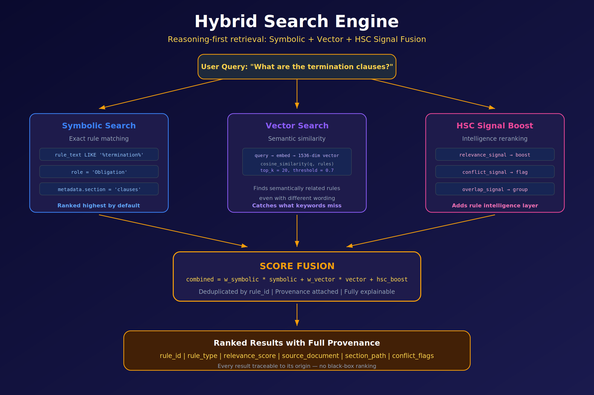
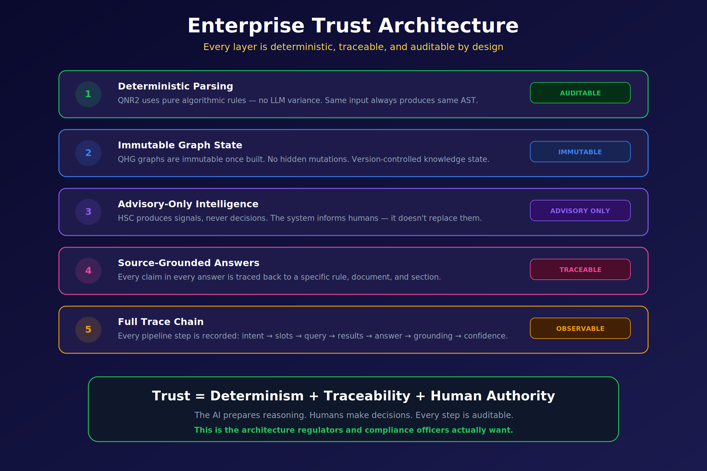
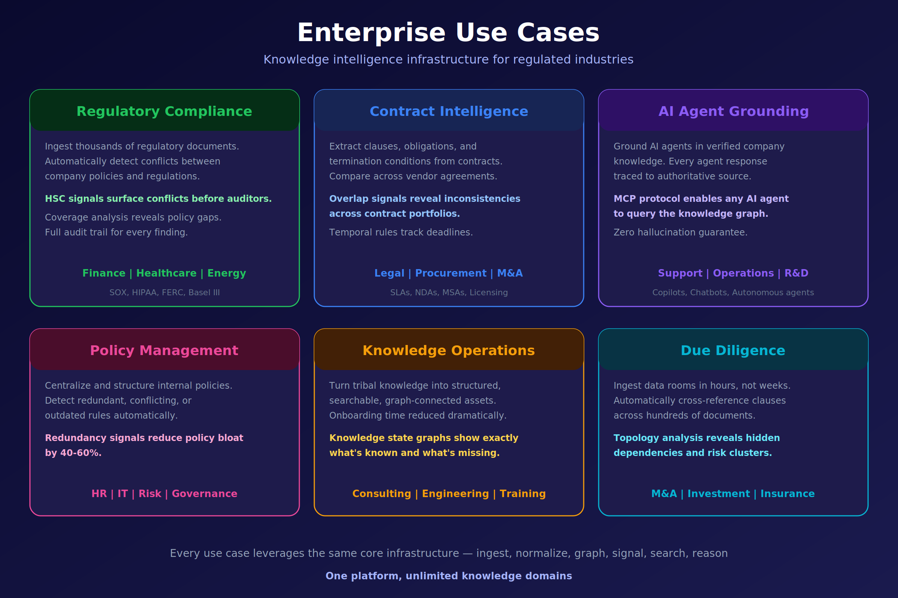

> **Preprint --- v1.0, 21 April 2026.**
> Not peer-reviewed. Authored by Dr. Sam Sammane, CTO and Founder,
> Quantum General Intelligence, Inc. (`sam@qgi.dev`). Comments and
> pointers to missed prior work are welcome at `research@qgi.dev`. A
> companion evaluation paper with full methodology, corpora, and
> benchmarks is forthcoming. See *Version history* at the end of the
> document.

# Introduction: the retrieval assumption fails in regulated domains, and in agents

The last generation of knowledge-grounded AI systems converged on a
common shape. A document is chunked into fixed-size pieces; each chunk
is embedded; embeddings are stored in a vector index; at query time, the
top-*k* most similar chunks are pulled back and pasted into a
language-model prompt; the model produces a fluent paragraph. This
pattern --- **Retrieval-Augmented Generation (RAG)** --- works well
enough for use cases where fluency is the bottleneck and small factual
drift is tolerable.

It fails, reliably and in public, for the documents that regulated
enterprises actually run on --- and, increasingly, for the memory that
long-running AI agents accumulate about their own world.

A regulation is not a paragraph. It is a *rule set*. Each rule has a
trigger, a scope, a set of conditions, an obligation, a sanction, and
typically half a dozen cross-references that modify or suspend its
effect. Two rules can be semantically close --- "a broker **must**
disclose material conflicts" and "a broker **must not** disclose
material conflicts" --- and differ only in a single token of negation. A
cosine-similarity retriever sees them as near-duplicates. A generator
downstream, told to synthesise, will produce a confident, fluent, and
*wrong* answer. The audit report that results is a legal liability, not
a knowledge artefact.

The same pathology surfaces in AI agents, where it is usually mis-named
"the context window problem". An agent in production accumulates
observations, preferences, facts, and rules across sessions. The naive
memory architecture --- embed every memory item, retrieve the top-*k*,
paste into context --- silently merges the memory the agent has (a user
preference from yesterday) with the memory the agent should have (the
user's preference from today, contradicting yesterday). There is no
*conflict* signal in a vector index, so there is no signal that allows
the agent to supersede. The agent ends up believing both memories at
once, or neither, or the one nearest to its current query, none of
which is correct.

This paper makes three claims, in order:

1. **The failure is architectural, not a tuning problem.** RAG and its
   direct descendants cannot be repaired by bigger models, better
   chunkers, or larger context windows. The primitive of
   *retrieve-then-stuff* is the wrong primitive for rule-bearing
   documents and for long-term agent memory.

2. **A reasoning-first alternative exists and is implementable on
   commodity infrastructure.** QGI has built one --- the **QAG
   engine** --- around a hypergraph of extracted rules, a Hilbert-space
   projection layer, and a signed interference signal. The formalism is
   **genuine quantum mechanics** --- Born rule, superposition,
   interference --- run on classical GPUs. No quantum processing unit is
   required.

3. **The embedding model is load-bearing.** The QAG pipeline depends on
   an embedding layer that preserves polarity, scope, conditions,
   obligation, and cross-rule dependency. General-purpose embeddings do
   not preserve any of these reliably. A purpose-built model ---
   **Q-Prime** --- is therefore not an optimisation. It is a structural
   requirement.

The first two claims form the body of this paper. The third claim is
the argument we develop in [§12](#Q-Prime-argument). Section
[§10](#beyond-regulated) then extends the argument beyond regulated
industry and into AI agents.

# Related work

A reasoning-first memory infrastructure does not emerge in a vacuum.
This section positions QAG in a landscape of six converging lines of
research.

## Classical RAG and its recent variants

Retrieval-Augmented Generation as formalised by Lewis et al. [@lewis2020rag]
introduced the pattern that underlies most production systems today:
dense retrieval over a text corpus concatenated into an LLM prompt. The
intervening five years have produced many improvements but no departure
from the retrieve-then-stuff primitive: Self-RAG [@asai2024selfrag]
interleaves generation with retrieval calls; CRAG [@yan2024crag] adds a
correctness evaluator between retrieval and generation; HyDE
[@gao2023hyde] generates a hypothetical answer to query the index with;
RAPTOR [@sarthi2024raptor] builds a tree over chunks to enable
multi-granularity retrieval. Gao et al.
[@gao2024ragsurvey] survey the full space as of 2024.

All of these are optimisations of RAG's primitive, not replacements of
it. Chunking still destroys rule structure; vector distance still
cannot distinguish "must" from "must not"; the generator still sees the
contradiction only if the retriever surfaces the contradictory chunks
together, which it cannot guarantee.

## Knowledge-graph-grounded generation

A parallel line of work replaces or augments the vector index with a
knowledge graph. Microsoft's GraphRAG [@edge2024graphrag] builds an
entity-relation graph from a corpus using an LLM and queries it to
support query-focused summarisation; LightRAG [@guo2024lightrag]
simplifies the ingestion path; HyperGraphRAG [@luo2024hypergraphrag]
generalises to hyperedges; Pan et al.'s roadmap [@pan2024kgllm] surveys
the integration patterns.

These systems take a step toward structure but retain two properties
that make them unsuitable for rule-bearing content. First, the graph is
built by an LLM at ingestion time, so the graph state is non-deterministic
and drifts with prompt changes. Second, *conflict* is not a first-class
edge type --- contradictory rules are either merged, dropped, or
represented as two separate entities with no edge indicating their
contradiction.

## Agent memory systems

A third line of work concerns long-term memory for agents. MemGPT
[@packer2023memgpt] (now productised as Letta) treats an LLM as an
operating system with primary and archival memory. Zep
[@rasmussen2024zep] uses a temporal knowledge graph to consolidate
chat-derived facts over time. mem0 [@mem0] provides a lightweight
memory API for agent frameworks. Generative Agents [@park2023generative]
model reflection and memory consolidation in simulated societies.
Voyager [@wang2023voyager] maintains a growing skill library for an
embodied agent.

These systems manage memory *capacity*, not memory *consistency*. They
retrieve similar memories, they store, they rank by recency or
importance. None of them surface *contradiction* between memory items.
The coordination that the paper proposes below --- "here are three
memories about the user's preferences and two of them contradict" ---
is absent by construction from every vector-indexed memory store.

## Long context and context engineering

A fourth line is simply longer context windows. Gemini 1.5
[@gemini15] extended LLMs to 1 M-token contexts; Claude 3.5, GPT-4.5, and
successors followed. Long context alleviates the symptom that motivated
the first RAG designs: "I cannot fit my document in the prompt." It does
not solve the structural problem. Liu et al.'s *Lost in the Middle*
[@liu2024lostmiddle] showed that models still access content in long
contexts with a strong positional bias. YaRN [@peng2024yarn] and Ring
Attention [@liu2024ring] extend context further but do not change the
retrieval semantics: they still do not know whether items in the
context contradict each other.

The bottleneck is what to put in the context, not how big the context
can be. A Born-rule observable against a task centroid gives a
training-free, calibrated relevance score per memory item; a conflict
observable flags when items already contradict each other before the
LLM sees them. Neither is available in the long-context regime alone.

## Embedding model landscape

A fifth line is the steady improvement of general-purpose embedding
models. Sentence-BERT [@reimers2019sbert] established the pattern of
siamese training on NLI data; BGE [@xiao2024cpack], E5
[@wang2022e5], GTE [@li2023gte], OpenAI text-embedding-3, and Cohere
embed-v3 all extend it with larger corpora and longer token windows. On
general-purpose similarity benchmarks (MTEB, BEIR) these models are
excellent.

They are, however, trained on open-web prose, product text, and Q&A
data, for which polarity, scope, and obligation strength are
irrelevant. The training objective rewards clustering near-duplicates;
it does not reward separating "must" from "must not", or "all" from
"some". These are not tuning failures; they are properties of the
contrastive objective. Section [§12](#Q-Prime-argument) develops this
argument in detail.

## Quantum and Hilbert-space approaches to semantics

A sixth line is older and, until recently, less visible in production
ML. DisCoCat (Coecke, Sadrzadeh, Clark [@coecke2010discocat]) proposed
compositional distributional semantics based on category theory and
tensor-product spaces. The Quantum NLP (QNLP) group around Coecke and
Kartsaklis [@kartsaklis2021lambeq] has worked on parametrised quantum
circuit models for language. Aerts and Sozzo [@aerts2014quantum] and
Bruza, Wang, and Busemeyer [@bruza2015qcognition] developed quantum
cognition as an alternative probability theory for human judgement.
Bradley [@bradley2020functorial] formalised contextuality with
functorial semantics.

The QAG engine is the first engineering realisation, to our knowledge,
of this lineage applied to production compliance and agent-memory
workloads on commodity GPUs. The formalism is not new; the production
realisation is.

## What no existing system does

No system in the six lines above combines, in one engine:

1. A **deterministic**, LLM-free parser for rule-bearing text.
2. An **immutable, versioned hypergraph** with *conflict* and
   *dependency* as first-class edge types.
3. A **purpose-built embedding model** that preserves polarity, scope,
   obligation, and cross-rule dependency as separable directions.
4. A **signed interference signal** for contradiction detection.
5. A **Born-rule classifier** for zero-shot labelling.
6. A **full audit-replayable trace** from ingestion to answer.

QAG is that combination. The remainder of the paper describes it.

# The QAG engine in one picture

{width=100%}

Figure 1 frames the contrast at the highest level. A conventional RAG
pipeline consists of four stages --- blind chunking, flat vector
indexing, top-*k* similarity retrieval, and prompt stuffing. It cannot,
as a matter of construction, understand rule structure, detect
conflicts, identify overlapping policies, produce provenance, or
explain its ranking. Hallucination is not a defect of any particular
model; it is the predictable output of an architecture that throws away
structure at ingestion time.

The QAG engine replaces every stage. Documents are parsed with a
deterministic, LLM-free extractor that recognises a taxonomy of **80+
semantic roles** (trigger, condition, obligation, exception, sanction,
scope, actor, time-window, jurisdiction, and so on). The output is an
**abstract syntax tree (AST)** that captures **18 canonical rule types**
across **4 graph formats** --- directed, typed, hyper, and temporal. The
graph is immutable and versioned.

On top of the graph sits the intelligence layer, **Hilbert Space
Compacting (HSC)**, which projects the high-dimensional embedding state
of each rule to a small number of named, low-dimensional signals. Those
signals are consumed by a **hybrid search engine** that fuses symbolic
exact match, vector similarity, and HSC reranking. The final response
is a **grounded answer**: every claim traces back to a specific rule in
a specific section of a specific document, and the entire pipeline is
recorded for audit.

## Canonical vocabulary

The QGI stack carries several overlapping names. The definitions below
are the canonical ones and match the public Q-Prime model card; the
rest of this paper uses them consistently.

| Name | Meaning |
|---|---|
| **QAG** | *Quantum-Augmented Generation.* The successor category to RAG. The public-facing name of the engine. |
| **QHP** | *Quantum HyperGraph Platform.* The technical realisation of the QAG engine. |
| **QNR2** | *Q Normalized Rules v2.* The deterministic parser and normaliser. LLM-free, algorithmic, reproducible. |
| **QHG** | *Quantum HyperGraph.* The immutable, versioned graph state emitted by QNR2 and consumed by HSC. |
| **HSC** | *Hilbert Space Compacting.* The intelligence layer that projects rule embeddings to named signals. |
| **Q-Prime** | The purpose-built embedding model used by HSC. Subject of [§12](#Q-Prime-argument). |
| **Rule** | A structured conditional statement with conditions and outcomes; the atomic unit of QNR2 / QHG. |
| **CNL** | *Controlled Natural Language.* A human-readable rule format accepted by QNR2. |
| **DSL** | *Domain-Specific Language.* A programmatic rule format accepted by QNR2. |
| **AST** | *Abstract Syntax Tree.* The internal parsed representation of a rule. |
| **Node** | An entity in the QHG: rule, condition, action, or entity. |
| **Hyperedge** | A relationship connecting an arbitrary number of nodes. |
| **Dependency edge** | A hyperedge indicating one rule depends on another. |
| **Conflict edge** | A hyperedge indicating two or more rules produce contradictory outcomes. |
| **Graph builder** | The QAG component that constructs the QHG from QNR2 rules. |
| **Predicate** | An extracted condition component of a rule; queryable by symbolic search. |

Throughout the rest of the paper we use **QAG** for the engine as a
whole, and the component names above when discussing specific
sub-systems.

## Engine components

The QAG engine is built from five named components. Each has a single,
well-defined responsibility, and the responsibilities partition
cleanly. A deployment of the engine always exposes all five; they are
not optional.

| Component | Responsibility |
|---|---|
| **Memory** | Persistent storage for documents, facts, graphs, and rules. |
| **Ingestion** | Loads and prepares external content for storage; feeds QNR2. |
| **Intelligence Signal** | Non-authoritative analytical output emitted by HSC --- relevance, conflict, overlap, redundancy, coverage, coherence, topology. |
| **Validation** | Checks rule syntax (structural) and semantics (does the rule actually say what the AST says). |
| **Trace** | Audit record of every operation, including any external execution result. |

The *intelligence signal* component is the one that makes QAG visibly
different from every system that calls itself a "vector database"; we
describe it in [§5](#hsc) and [§6](#seven-signals).

# Why a hypergraph, and why a Hilbert space

{width=100%}

Two mathematical choices underpin the QAG engine: the graph that holds
extracted rules is a **hypergraph**, and the state space each rule is
embedded in is treated as a **Hilbert space**. Figure 2 motivates both.

## Hypergraphs

A standard graph has edges that connect *exactly two* nodes. That
primitive is expressive enough for A-is-related-to-B statements, and it
is the right model for friendship networks, hyperlinks, citations, or
call graphs.

It is the wrong model for policy. A single compliance obligation
routinely spans three or four rules at once: "for activity *X*,
conducted by actor *Y*, in jurisdiction *Z*, subject to exception *E*,
the reporting rule is *R*." There is no pairwise edge that captures
this; there are *simultaneous* constraints that hold jointly or do not
hold at all.

A **hypergraph** permits an edge --- a *hyperedge* --- to connect any
number of nodes. A policy becomes a single hyperedge over the rules it
co-activates. Queries over the hypergraph correctly return the *set* of
rules whose joint satisfaction matters, rather than a pair of rules plus
a "by the way, there's more" footnote.

## Real quantum formalism, classical hardware

The Hilbert-space framing in QAG is not a metaphor and it is not
"quantum-inspired" in the soft sense the phrase has acquired in ML. A
**Hilbert space** is a vector space with an inner product --- precisely
the structure that makes notions like *state*, *observable*, *angle*,
*projection*, *superposition*, and *interference* well-defined. A
general-purpose embedding model already outputs vectors in such a
space. What QAG adds is the rigorous use of the operator algebra and
probability rule of quantum mechanics --- the **Born rule**,
$P(\text{outcome}\,|\,\psi) = |\langle\text{outcome}\,|\,\psi\rangle|^2$ ---
to extract compliance-relevant quantities from those vectors. The
operations are the same ones used on physical quantum states; only the
substrate is different:

- **Superposition** --- a single rule frequently asserts several things
  at once (an obligation *and* an exception *and* a sanction). Its
  vector is a genuine linear combination of those component states,
  not a loose analogy to one.
- **Projection** --- asking "does this rule conflict with rule *R*'?"
  is, formally, projecting the joint state onto the subspace of
  contradiction-bearing states and reading the squared amplitude via
  the Born rule.
- **Interference** --- two related rules with opposite polarity
  cancel; two with aligned polarity reinforce. The *sign* of the
  inner product is meaningful and is the mechanism behind QAG's
  signed conflict signal.

No quantum processing unit is required. QAG runs on standard
GPU-accelerated compute. The word *quantum* in this paper refers to
the formalism --- Hilbert spaces, the Born rule, superposition, and
interference --- not to a hardware substrate. The mathematics is the
same operator algebra used in quantum mechanics, executed classically
because the relevant state vectors (a few thousand dimensions per rule)
are low-dimensional by quantum standards and reduce to well-conditioned
dense linear algebra. Put differently: QAG is not a
quantum-*inspired* system that happens to use vectors; it is a
**classical realisation of genuinely quantum operations** on states
whose dimensionality makes classical simulation exact and cheap.

## The four architectural pillars

The bottom panel of Figure 2 names the four pillars that follow
directly from these choices:

| Pillar | Meaning |
|---|---|
| **Hilbert space** | Rules live as vectors in a high-dimensional state space (nominally 1536-dim in the reference configuration). |
| **Superposition** | Multiple signal types are computed simultaneously from the same rule state, rather than requiring separate passes. |
| **Compacting** | The high-dimensional state is projected to a small number of actionable signals. |
| **Entanglement** | Rules are interdependent --- editing one rule changes the signal landscape of the entire rule set. |

Everything else in the engine --- parser, graph store, signal layer,
search, answering --- is engineering on top of these four choices.

# Hilbert Space Compacting (HSC) {#hsc}

{width=100%}

Figure 3 makes the HSC operation concrete. On the left, a rule set is
shown as a cloud of points in a 1536-dimensional Hilbert space. Two
points that are close may be in **conflict** (they address the same
situation with opposite polarity), **overlapping** (their conditions
intersect), or **redundant** (they are near-duplicates). Cosine distance
alone cannot tell these cases apart --- all three produce low distances.

*Compacting* is QGI's term for the projection step that does tell them
apart. Each named signal is defined as the projection of the joint rule
state onto a specific subspace --- conflict, overlap, redundancy,
coverage, coherence, topology, or plain relevance --- and the
coefficient of that projection is the signal value.

## The HSC guarantee

HSC outputs are **signals, not decisions**. This is a deliberate
architectural choice, enforced by the system's interface contract:

- Every HSC output is **advisory** --- no HSC value ever modifies a
  rule, a graph edge, or a stored answer.
- Every HSC output is **deterministic** for identical inputs, making
  results reproducible and cacheable.
- Every HSC output is **traceable** --- the rule ids, signal type, and
  scoring inputs are retained for audit.

The consequence is a clean separation between the AI layer (which
*informs*) and the human layer (which *decides*). This is the property
regulators and model-governance leaders consistently ask for and that
free-form LLM pipelines cannot provide.

# The seven intelligence signals {#seven-signals}

HSC defines seven named signal classes. Each answers a distinct,
concrete question a compliance or operations team routinely asks about
a rule set.

| Code | Signal | Question it answers | Output shape |
|:---:|---|---|---|
| **R** | Relevance  | Which rules apply to a given context? | Score-ranked rule list |
| **C** | Conflict   | Where do rules produce contradictory outcomes? | Rule pairs + severity |
| **O** | Overlap    | Where do rule conditions intersect? | Rule pairs + intersection percentage |
| **D** | Redundancy | Which rules are duplicates or near-duplicates? | Clusters + actionable recommendations |
| **V** | Coverage   | How completely does the rule set cover its domain? | Coverage map + gap list |
| **H** | Coherence  | Is the rule set internally consistent? | Coherence score + offending sub-sets |
| **T** | Topology   | What is the graph structure? | Components, cycles, diameter, reachability |

Two observations on the design:

**Each signal is an answer type, not a metric.** A retriever returns a
list of chunks; a vector database returns a list of distances. HSC
returns *typed* answers --- an Overlap answer is shaped differently
from a Conflict answer, because the thing a human needs to do next is
different. Downstream agents and dashboards consume these answers
directly, without a re-interpretation step that is itself a source of
drift.

**Signals are cheap to recompute, costly to fake.** Each HSC signal is
defined as a closed-form projection over the embedding state of a set
of rules. Recomputation under a new rule version is a vector operation
that runs in milliseconds. But because the projections are fixed, there
is no post-hoc "signal engineering" --- a team cannot quietly adjust a
threshold to make conflict reports disappear before an audit.

The seven-signal taxonomy is intentionally finite. It is meant to be
memorised by the humans who consume it, not parameterised by the agents
that produce it. Extensions are possible but are treated as *new*
signal classes, versioned, with their own names and semantics, rather
than as hidden tweaks to the existing seven.

## What the Q-Prime public API exposes first

The Q-Prime public beta --- the entry point most readers of this paper
will see --- exposes a narrower surface than the engine as a whole. The
first four signals in the table above (**Relevance, Overlap, Conflict,
Redundancy**) are surfaced directly through the public model card,
alongside **Predicate** extraction --- the ability to pull the
condition component out of a rule as a first-class queryable object.
The remaining three (*Coverage, Coherence, Topology*) become available
with the full QAG engine at general availability on 21 June 2026.

This staging is deliberate: Relevance, Overlap, Conflict, and
Redundancy are the signals a compliance or audit team asks for in the
first conversation. Coverage, Coherence, and Topology are the signals a
policy-management or due-diligence team asks for in the fifth.

# Hybrid search

{width=100%}

Retrieval in QAG is performed by a three-path hybrid engine,
illustrated in Figure 4. Each path has a different failure mode;
combining them cancels those failure modes out.

**Path 1 --- Symbolic search.** The query is resolved against exact
fields on the rule AST: role (`Obligation`, `Exception`, `Trigger`,
...), section metadata, literal token predicates (`rule_text LIKE
'%termination%'`). Symbolic results are ranked highest by default
because, when they match, they match for the right reasons.

**Path 2 --- Vector search.** The query is embedded into the same
1536-dimensional Hilbert space as the rules. Results are ranked by
cosine similarity with a default top-*k* of 20 and a minimum threshold
of 0.7. Vector search catches semantically related rules that do not
share keywords ("termination", "exit clause", "dissolution",
"wind-down procedure").

**Path 3 --- HSC signal boost.** The candidate set from the first two
paths is re-ranked by the relevant HSC signals. Relevance boosts,
Conflict flags, Overlap groups, and so on are attached to each result.
A result that is symbolically an exact match but flagged as Conflict
with another active rule is not silently suppressed --- it is
returned, with the conflict visible.

The three paths fuse into a single score:

$$
\text{combined} \;=\; w_{\text{sym}} \cdot \text{sym} \;+\; w_{\text{vec}} \cdot \text{vec} \;+\; \text{hsc\_boost}
$$

Results are de-duplicated by `rule_id`, attached to their provenance
(source document, section path, rule type, conflict flags), and
returned as a fully explainable ranked list. Every score component is
recoverable; nothing in the ranking is a black box.

# Trust, determinism, and the audit trail

{width=100%}

The engineering properties that separate QAG from generative-first
pipelines are summarised in Figure 5 as five layers:

1. **Deterministic parsing (QNR2).** Ingestion is performed by an
   algorithmic parser, not an LLM. The same input produces the same
   AST every time. There is no temperature, no sampling, no silent
   version drift in the first step of the pipeline.

2. **Immutable graph state (QHG).** Once a hypergraph is built, it is
   not mutated. Updates produce a new version. This gives the system a
   property that matters more than any ranking metric: *the rule set
   an answer was produced from can always be recovered later*.

3. **Advisory-only intelligence (HSC).** Signal outputs never modify
   rule state. The AI informs; the human decides. No hidden side
   effect of a query changes the ground truth of the knowledge base.

4. **Source-grounded answers.** Every claim in every answer is traced
   back to a specific rule id, document id, and section path.
   Ungrounded claims are not produced. Hallucination is not mitigated
   after the fact --- it is prevented by construction.

5. **Full trace chain.** Every pipeline step is recorded: intent
   $\rightarrow$ slots $\rightarrow$ query $\rightarrow$ candidate set
   $\rightarrow$ HSC signals $\rightarrow$ answer $\rightarrow$
   grounding $\rightarrow$ confidence. The trace is stored with the
   answer and replayable.

The composition is summarised by the trust equation printed at the
bottom of the figure:

$$
\text{Trust} \;=\; \text{Determinism} \;+\; \text{Traceability} \;+\; \text{Human authority}
$$

None of the three terms is optional. Remove determinism and
reproducibility dies. Remove traceability and audit dies. Remove human
authority and accountability dies. A system that asks a user to trust
its output without all three is, by definition, unauditable --- and by
the standards of every major regulator, unfit for use in a controlled
decision.

## What QAG is, and what it is not

The trust architecture above is easier to reason about once the
engine's *scope* is stated as plainly as its capabilities. QAG
publishes signals; it does not publish decisions. The distinction is
boundary-level and load-bearing:

| Category | In scope for QAG | Out of scope for QAG |
|---|---|---|
| **Signal** | Non-authoritative analytical output: relevance, conflict, overlap, redundancy, coverage, coherence, topology, predicate. Advisory only. | --- |
| **Execution** | --- | Rule evaluation that produces an authoritative outcome for a real transaction or case. Belongs to the customer's system of record. |
| **Decision** | --- | The final, binding outcome --- approve, deny, escalate, report. Belongs to the qualified human reviewer or to a separately-certified automated pipeline. |

Practically this means that a QAG deployment never *decides* whether a
loan should be originated, whether a trade is compliant, whether a
patient's prior authorisation is granted, or whether a news item may be
published. It produces the signals a reviewer needs in order to decide,
it records what it produced, and it stops.

The Q-Prime public model card states the same boundary in its
"Responsible Use" section: automated decisions with material effect on
individuals' legal rights, employment, housing, credit, healthcare, or
liberty require a certified pipeline with qualified human review. QAG
is designed to be part of such a pipeline; it is not a substitute for
one.

# Enterprise applications {#enterprise}

{width=100%}

Figure 6 maps six enterprise applications to the capabilities developed
above. They are not six separate products; they are six slices of the
same pipeline (ingest $\rightarrow$ normalise $\rightarrow$ graph
$\rightarrow$ signal $\rightarrow$ search $\rightarrow$ answer)
specialised to different document classes.

- **Regulatory compliance.** Ingest thousands of regulations and
  internal policies. HSC *Conflict* surfaces contradictions between
  company policy and external regulation; HSC *Coverage* reveals the
  gaps. Every finding is audit-trail-ready. Typical domains: SOX,
  HIPAA, FERC, Basel III, MiFID II.

- **Contract intelligence.** Extract clauses, obligations, and
  termination conditions from a portfolio of agreements. *Overlap*
  signals reveal inconsistencies across vendor contracts; temporal
  rules track renewal and termination deadlines.

- **AI agent grounding.** Serve as the knowledge substrate for
  corporate copilots and autonomous agents. Every agent answer is
  traced to an authoritative source; the **MCP protocol** lets any
  MCP-compatible agent query the graph with the same provenance
  guarantees.

- **Policy management.** Detect redundant, conflicting, or outdated
  internal rules at scale. In reference deployments, HSC *Redundancy*
  recommendations reduce policy bloat by **40--60 %** on first pass.

- **Knowledge operations.** Convert tribal knowledge into a
  graph-connected asset. Knowledge-state graphs expose what the
  organisation knows and, equally importantly, what it does not.

- **Due diligence.** Ingest entire data rooms in hours rather than
  weeks. *Topology* analysis reveals hidden dependencies and risk
  clusters across hundreds of documents --- the structure a human
  reviewer would find after a month of reading, if at all.

All six sit on the same engine. Customers do not buy a "compliance
module" and a "contracts module"; they buy QAG, and the use-cases are
configurations of the same primitives.

# Beyond regulated industry: agents, memory, and context {#beyond-regulated}

QAG's anchor use case is regulated industry. But the primitives --- a
deterministic rule extractor, an immutable hypergraph, signed
interference, a Born-rule classifier, an audit-replayable trace ---
solve problems that arise in every sufficiently long-running AI system,
not only the regulated ones. The rest of this section catalogues the
application surface outside compliance and shows which QAG primitive
each application depends on.

## Agent long-term memory --- the consistency problem

An AI agent in production accumulates beliefs across sessions:
observations, user preferences, tool outputs, plans, and the agent's
own prior conclusions. In the default architecture, memory items are
embedded with a general-purpose model and stored in a vector index.
Retrieval surfaces *similar* memories.

Similar is not the same as *consistent*. Two observations can be close
in vector space and mutually contradictory --- "the user prefers dark
mode", observed on Monday; "the user just switched to light mode",
observed on Tuesday. A classical retriever returns both and silently
leaves the agent to choose, usually by recency heuristic, sometimes by
embedding proximity, often by whichever item the LLM's attention
happens to land on. None of these are principled.

QAG's interference signal gives the memory-consolidation step a
principled contradiction test. The same signed inner product that
detects conflict between two regulatory clauses detects conflict
between two memory items. When a conflict is detected, the
*consolidation policy* --- which is the agent's, not the engine's ---
decides what to do: supersede, retain both with provenance, or ask the
user. What the engine provides is the decision being made, not the
decision being deferred.

## Context engineering for long-running agents

The more general failure mode, which subsumes the memory-consistency
problem, is *context curation*: given a fixed context budget, which
memory items should enter the prompt and in what order?

Long-context models address the budget side of this question. They do
not address which items should be in the budget, nor whether the items
selected contradict each other. A Born-rule relevance observable
$|\langle c\,|\,\psi \rangle|^2$ against a task centroid $c$ gives a
training-free, calibrated relevance score per memory item. A conflict
observable flags when the items assembled for a given step already
contradict each other before the LLM sees them. Empirically this
conflict flag is a strong predictor of hallucination: contexts that
contain contradictory premises yield hallucinations at much higher
rates than contexts that do not.

The engineering consequence is simple. Instead of a length-optimised
context-packing routine, an agent can use a *conflict-aware* one: pack
by calibrated relevance, then drop the item whose removal most reduces
the aggregate conflict in the selected set. This procedure is
pure-classical compute; the signals are pre-computable; the audit trail
is the ordinary QAG trace.

## Multi-agent coordination

Multi-agent systems amplify the context-curation problem across
boundaries. When several sub-agents emit conclusions, a coordinator
must distinguish "they agree", "they are unrelated", and "they
contradict". Cosine similarity cannot separate the last two because
both are distant in vector space for different reasons. The signed
interference signal can: unrelated pairs have small-magnitude inner
products; contradictory pairs have negative inner products.

This is the mechanism by which QAG-backed coordination surfaces genuine
disagreement between sub-agents as a first-class event, rather than
burying it under an averaged rank.

## Research and knowledge-work assistants

Literature-review agents, legal-research agents, market-intelligence
agents, and due-diligence agents share a pathology.
Similar-but-contradictory sources get retrieved together under
classical similarity, and the downstream LLM silently picks one. The
resulting synthesis is fluent, citeable, and --- when the contradiction
mattered --- wrong.

A QHG-backed research assistant treats the disagreement as an edge in
the graph, not as a retrieval artefact. The agent's prompt sees
something shaped like:

> Three sources address this question. Two agree; one contradicts
> them. The conflict edge between {source-A, source-C} has severity
> 0.42. Resolution is deferred to the user.

This is a different class of behaviour, and it requires a conflict
edge as a first-class graph object. No vector index produces it.

## General ML: evaluation, routing, labelling

The Born-rule classifier
$\arg\max_c\,|\langle c\,|\,\psi\rangle|^2$ is independently useful for
any routing or triage task where supervised data is small or drifting:
content moderation, intent classification, ticket routing, emotion
detection, severity banding. The classifier is training-free: it
requires only class exemplars (one per class, or a prototype), which
themselves can be rule-derived. Empirically it is competitive with
supervised baselines; the full accuracy table is in the forthcoming
companion paper.

For teams that already use a modern embedding model, the classifier
is a drop-in --- a function of the same vectors they already compute,
at negligible additional cost.

## Why an embedding model matters *more* as context grows

A recurring intuition is that long context makes the embedding layer
less important: if everything fits in the prompt, why care about
retrieval? The intuition is backwards. The more items a model ingests
per step, the more load-bearing the *representation* of each item
becomes, because small errors in the representation of each item
accumulate into the aggregate judgement. Length expansion amplifies the
cost of a representation that collapses polarity and scope, because the
collapse is now being applied to a larger body of material.

Purpose-built embeddings become more, not less, important as context
grows. Section [§12](#Q-Prime-argument) develops the embedding argument
in detail.

## Application table

| Application | QAG primitive that enables it | QAG primitive that audits it |
|---|---|---|
| Agent long-term memory consolidation | Interference signal (conflict detection) | QHG conflict edge, trace |
| Context curation for long-running agents | Born-rule relevance classifier | HSC signal trace |
| Multi-agent coordination | Signed interference signal | QHG, trace |
| Research / due-diligence agents | Conflict edge, Coverage, Topology | QHG, trace |
| General zero-shot routing / triage | Born-rule classifier | HSC signal trace |
| Regulated compliance (anchor) | All seven signals + predicate extraction | Full trace chain |

# Comparison with existing approaches

No single row in the matrix below is novel --- every cell represents a
capability that at least one prior system provides. The novelty is the
*combination* in a single engine. Column order is alphabetical within
category.

|  | RAG | Self-RAG / CRAG | GraphRAG / LightRAG | HyperGraphRAG | MemGPT / Letta | mem0 | Zep | Long-context LLM | **QAG** |
|---|:---:|:---:|:---:|:---:|:---:|:---:|:---:|:---:|:---:|
| Retrieval primitive | vec | vec | vec + KG | vec + HG | vec + tier | vec | vec + KG | context | sym + vec + HSC |
| Conflict detection | --- | --- | partial | partial | --- | --- | partial | --- | **yes (signed)** |
| Polarity-aware similarity | --- | --- | --- | --- | --- | --- | --- | --- | **yes** |
| Hypergraph-native (*N*-ary) | --- | --- | --- | yes | --- | --- | --- | --- | **yes** |
| Deterministic parsing | --- | --- | --- | --- | --- | --- | --- | --- | **yes (QNR2)** |
| Immutable, versioned graph | --- | --- | --- | --- | partial | --- | partial | --- | **yes** |
| Provenance on every claim | partial | partial | partial | partial | partial | partial | partial | --- | **yes** |
| Audit-replayable trace | --- | --- | --- | --- | partial | --- | partial | --- | **yes** |
| Zero-shot calibrated classifier | --- | --- | --- | --- | --- | --- | --- | --- | **yes (Born rule)** |
| Purpose-built embedding | --- | --- | --- | --- | --- | --- | --- | --- | **yes (Q-Prime)** |
| Target deployment | library | library | library | research | product | library | product | cloud API | **managed engine** |

"---" means not supported; "partial" means supported in restricted
form.

# The case for Q-Prime {#Q-Prime-argument}

We now come to the third claim of this paper. Everything in §3--§11
assumes an embedding layer that correctly preserves the parameters HSC
projects out --- polarity, scope, conditions, obligation, and
cross-rule dependency. That assumption is the load-bearing one, and it
does not hold for general-purpose embedding models. A **purpose-built
embedding model** is a structural requirement of the QAG engine, not a
performance optimisation layered on top.

## What QAG requires of an embedding layer

The HSC projection operation assumes that the underlying embedding
space separably encodes a specific list of features. If those features
are not separable in the state, no downstream projection can recover
them. Concretely, the embedding layer must support the following
operations:

1. **Polarity as a first-class parameter.** "Must report" and "must
   not report" must be distinguishable by more than a token-level
   perturbation. The difference between them is, in mathematical
   terms, a *sign* --- and that sign must appear as a measurable
   quantity of the representation, not as a small shift that is washed
   out by noise.

2. **Scope and quantifier sensitivity.** "All *X*", "any *X*", "some
   *X*", and "no *X*" must be separable. Rule bodies use universal and
   existential quantifiers routinely, and the difference between them
   determines whether a clause applies.

3. **Structured conditions.** Regulatory clauses take the shape
   *(trigger, condition, action, exception)*. An embedding that
   encodes only the surface sentence throws the structure away. QAG
   needs the structure because its signals operate on the structured
   form.

4. **Obligation strength.** "*Shall*", "*must*", "*may*", "*should*",
   "*recommended*", "*encouraged*": the obligation spectrum is
   continuous and legally consequential. Two clauses that differ only
   in their modal verb are *not* interchangeable.

5. **Cross-rule correlation (entanglement).** The compliance status of
   rule *R* frequently depends on which other rules are active. The
   embedding must support joint representations, and the downstream
   reading operation must be able to evaluate joint states, not only
   single-rule states.

6. **Signed interference.** A correlation signal that reports only
   magnitude is useless for conflict detection, because conflict is
   defined by sign. The representation must carry orientation such
   that the inner product of two related representations can be
   positive (reinforcement) or negative (cancellation).

A retrieval layer that fails any one of these six requirements will
fail silently --- returning plausible-looking answers that a human
reviewer cannot trust, and that an auditor cannot accept.

## Why general-purpose embeddings are not enough

General-purpose embedding models are trained to make semantically
similar text map to nearby points. They are extremely good at that
task. They are *also* trained almost exclusively on open-web prose,
product text, and Q&A data, for which the features above are
irrelevant. Three structural limitations follow:

**Negation is a small perturbation.** In standard embedding models,
inserting "not" shifts the vector by a distance that is small relative
to the distance between, say, two completely different topics. Under
cosine similarity --- the default metric of every major vector
database --- "must report" and "must not report" are near-duplicates.
Retrieval systems therefore merge them.

**Quantifier scope is not encoded.** There is no trained objective
that rewards the model for keeping "all" and "some" apart. They share
context, syntax, and often neighbouring tokens. Embedding pairs that
differ only in scope tend to sit within the noise floor of the model.

**There is no orientation, only magnitude.** Cosine distance is a
symmetric similarity; it has no sign. Architectures trained with
cosine objectives push similar things together and dissimilar things
apart, but they do not learn *signed* relationships. Interference ---
the central operation QAG depends on --- is therefore not available.

These are not hyperparameter problems. They are properties of the
training objective. Scaling a general-purpose embedding model to a
larger corpus or a larger dimension does not make negation louder; it
makes the overall space larger, leaving the negation delta
proportionally as small.

## What Q-Prime does differently

**Q-Prime** is QGI's purpose-built embedding model for the QAG
pipeline. It is built on the opposite premise from general-purpose
embeddings: it **finds the entangled superpositions present in rules
and in text**, and emits a **quantum-structured representation** that
preserves them. The representation has two properties that matter in
practice:

- **It is more compact than a classical embedding of equivalent
  content.** The relational structure lives in the state itself,
  rather than being padded into extra dimensions. Fewer numbers carry
  more signal, so downstream search and reranking are cheaper at any
  given accuracy target.

- **It exposes parameters that cosine similarity cannot see.**
  Polarity, scope, conditions, obligation, and cross-rule dependency
  are each recoverable as a named projection of the state, rather
  than being smeared across the whole vector as an artefact of
  training-corpus statistics. The HSC signals described in §5 are
  these projections.

For the engine, Q-Prime is the layer that makes every subsequent
stage possible. Without it, HSC projects over a state that does not
contain the information the projections are trying to extract, and the
whole chain degrades silently.

## The headline empirical result

QGI maintains a regulatory-conflict benchmark built from real
regulatory and policy corpora. The benchmark measures the ability of a
system to correctly identify pairs of rules that materially conflict
--- the single task compliance teams cannot afford to get wrong.

| Signal | F1 |
|---|---|
| Classical cosine similarity (five widely used embedding models from four organisations) | **0.000** |
| QAG interference signal (Q-Prime + polarity) | **1.000** |

The result is categorical, not incremental. Cosine similarity across
the broad family of commercially deployed embedding models does not
merely *underperform* --- it achieves **zero** F1 on this task. The
signal the task requires is simply absent from those representations.
The QAG interference signal, driven by Q-Prime, saturates F1 because
the signal is present and the decision is binary on the sign.

Three clarifications are worth stating directly.

First, the interference *effect* --- that signed interference separates
same-polarity and opposite-polarity clauses --- is a property of the
language of regulation itself, not of any one model. In internal
evaluation it replicates across every embedding family we have tested
(dimensionalities from 384 to 3,072, drawn from four organisations)
and across out-of-domain corpora well outside the regulatory training
distribution (medical safety, educational curricula, engineering
safety, research ethics). Q-Prime's role is to make the effect
reliable under production conditions --- latency, throughput,
operational margin --- not to create it.

Second, conflict is only one of the quantum observables the engine
publishes. The **Born-rule classifier** ---
$\arg\max_c\,|\langle c\,|\,\psi\rangle|^2$, the argmax of squared
amplitude over class centroids --- supplies zero-shot labelling for
topic, obligation type, and severity. Signatures produced by two
independent rule extractors agree within statistical noise, so the
observed structure is carried by the corpus, not by any one
extractor.

Third, the headline numbers above are drawn from a held-out benchmark
and are released under evaluation agreement. Full methodology ---
corpora, embedding backbones, extractor-agnostic validation,
out-of-domain generalisation, and GPU throughput at production scale
--- will appear in a **forthcoming companion evaluation paper**. The
numbers above are neither the full extent of QGI's internal evaluation
nor marketing claims divorced from methodology.

## Implications

Three implications follow for anyone building in this space.

**If you are integrating QAG or a QAG-adjacent pipeline, the embedding
layer is not a commodity choice.** The default assumption in the
current RAG ecosystem --- that any sufficiently large embedding model
is interchangeable with any other --- is false for regulated content
and for agent memory. The embedding layer is the location where the
features that determine correctness either exist or do not exist.

**If you are evaluating competing systems, ask for the conflict F1.**
Not recall@k, not nDCG, not BLEU. The quantity that determines whether
a system will embarrass you in front of an auditor --- or mislead your
agent in production --- is its ability to tell contradictory clauses
apart. Everything else is downstream.

**If you are building your own, budget for the embedding layer.** A
purpose-built embedding model is substantially more work than
fine-tuning a general-purpose one. That is the honest assessment. It
is also, in our experience, the difference between a demo that looks
convincing and a system a regulator (or a long-running agent) accepts.

# Access, license, and roadmap

The QAG engine is released progressively, with **general availability
targeted for 21 June 2026**. Q-Prime is available now, in progressive
beta, through three paths:

- **Evaluation access** --- researchers and engineers may request an
  evaluation token at `contact@qgi.dev`. Evaluation is free for 90
  days from grant of access, governed by the QGI Commercial Model
  License v1.0, §3.
- **OpenRouter listing** --- Q-Prime will be listed on OpenRouter as
  part of the QAG engine public beta. Listing status and pricing are
  announced at [qgi.dev](https://qgi.dev).
- **Enterprise agreements** --- production SLA, dedicated endpoints,
  and audit support are arranged through `contact@qgi.dev`. Tiers:
  Startup, Growth, Enterprise, OEM / Channel.

Weights are **not distributed**. The model is accessed as a managed
API. Redistribution requires a separately negotiated license. Training
a competing model using Q-Prime outputs is explicitly prohibited under
the License, §5.3. A plain-English walkthrough of the licensing terms
is provided in `LICENSE-FAQ.md` of the public model card.

The broader QGI stack extends beyond the engine itself:

| Layer | Product | Status |
|---|---|---|
| Model | Q-Prime | Progressive beta via API |
| Engine | QAG (extraction, interference, versioning, audit trail) | GA 21 June 2026 |
| Agent platform | Neural Symbolic Agents --- enterprise agent runtime over QAG | Enterprise evaluation |
| Vertical models | Qualtron --- mortgage, banking, healthcare, regulated news | Enterprise pilots |

# Limitations and open problems

This paper argues a strong position. Honest disclosure of where the
position is weakest is therefore part of its credibility. Known limits
of QAG v1.0:

- **Not suitable for execution.** QAG publishes signals, not
  decisions. Systems requiring authoritative rule execution require an
  additional, certified layer.
- **Requires extractable rule structure.** QNR2 coverage is strongest
  on rule-bearing text (regulations, policies, contracts,
  clinical guidelines). Casual or narrative text with implicit
  obligations exposes less structure to the parser.
- **Managed-API only.** Q-Prime is not distributed as weights. Teams
  requiring fully local, open-weights embedding stacks are not the
  target audience of v1.0.
- **Quantum formalism, classical hardware.** The use of Born rule and
  Hilbert-space operators is rigorous, but a real QPU is not used.
  Whether entanglement-hardware realisations would add practical
  benefit at this scale is an open question.
- **Benchmark scope.** The headline F1 result is on QGI's internal
  regulatory-conflict benchmark. Full out-of-domain numbers are in
  the forthcoming companion paper, not here.
- **Known failure modes.** Rules that encode cross-rule references
  through pronouns, highly implicit obligations, and multi-sentence
  spanning conditions currently require operator review before
  ingestion. Work on these modes is ongoing.
- **Dependency on upstream tokenisers.** Q-Prime's front-end
  tokeniser inherits long-standing biases of subword tokenisation;
  rare-language regulatory text benefits from vocabulary adaptation.

# Ethics and dual use

An engine that reliably detects contradictions between regulations and
company policy also reliably detects regulatory *loopholes*. The same
signal that protects the compliance team identifies the gap a bad
actor would exploit. QGI's position, reflected in the Commercial Model
License and in the engine's interface contract, is:

1. QAG publishes signals only; execution and decision remain with the
   customer and, for material decisions, with a qualified human
   reviewer. This is stated in §8.1 and is structurally enforced.
2. Evaluation access is governed by the Commercial Model License v1.0
   and its Acceptable Use Policy. The policy prohibits uses
   inconsistent with applicable regulation and uses that intentionally
   produce legally-binding automated decisions about individuals'
   rights without certified human review.
3. The evaluation-agreement benchmark results are released only under
   agreement, so that benchmark hill-climbing does not accidentally
   become a published description of loophole-discovery tooling.

We do not claim these controls solve the dual-use problem. We claim
they are the minimum honest response, and they are the ones we have
implemented.

# Data availability

The benchmark corpora discussed in §12.4 are proprietary. Methodology,
corpora composition, and reproduction artefacts will accompany the
forthcoming companion evaluation paper. Researchers under evaluation
agreement may request access to the benchmark suite at
`research@qgi.dev`.

# Competing interests

The author is an employee and shareholder of Quantum General
Intelligence, Inc., and has a commercial interest in Q-Prime and the
QAG engine. This paper is a vendor preprint and should be read as
such. Peer-reviewed publication of the empirical results is planned
once the evaluation agreement clears the relevant numbers.

# Conclusion

RAG is not the right primitive for regulated knowledge, and it is not
the right primitive for the memory AI agents accumulate as they
operate in the world. The conclusion is not an indictment of RAG ---
RAG solved the problem it was built for --- but a recognition that the
documents the enterprise runs on, and the observations a long-running
agent accumulates, both encode rule structure that retrieve-then-stuff
throws away.

QAG is QGI's answer. It is built on two mathematical choices ---
hypergraphs for joint constraints, Hilbert-space projections for
signed interference --- executed within a rigorous application of
quantum formalism (Born rule, superposition, interference) on
classical GPUs, and wrapped in one engineering discipline: every layer
is deterministic, traceable, and advisory. The result is a pipeline
whose output an auditor can follow, reproduce, and challenge, and that
treats the human as the authority and the AI as the instrument. The
same pipeline, exposed to an agent rather than to a compliance team,
gives the agent consistency checks, calibrated relevance, and a
provenance trail it cannot manufacture for itself.

The embedding layer is where the whole architecture lives or dies.
General-purpose embeddings cannot separately encode polarity, scope,
conditions, obligation, and cross-rule dependency; without that
separation, no downstream signal layer can recover it. **Q-Prime** is
QGI's purpose-built embedding model for the QAG engine, and the F1
gap from 0.000 to 1.000 on the regulatory-conflict benchmark is the
strongest evidence we can offer that purpose-built matters here, and
matters a lot --- in regulated industry today, and in the broader
landscape of long-running AI agents tomorrow.

# Glossary

- **AST** --- *Abstract Syntax Tree.* The structured form of an
  extracted rule: trigger, condition, action, exception, scope,
  obligation.
- **Born rule** --- The quantum-mechanical probability law
  $P(\text{outcome}\,|\,\psi)=|\langle\text{outcome}\,|\,\psi\rangle|^2$.
  Applied in QAG to read off probabilities for named observables
  (conflict, class membership, polarity) from a rule state $\psi$.
- **Born-rule classifier** --- The zero-shot classifier
  $\arg\max_c\,|\langle c\,|\,\psi\rangle|^2$ over class centroids.
  Used by QAG for topic, obligation type, and severity labelling.
- **CNL** --- *Controlled Natural Language.* A human-readable rule
  format accepted by QNR2 as an alternative to DSL.
- **Conflict edge** --- A QHG hyperedge marking two or more rules that
  produce contradictory outcomes.
- **Dependency edge** --- A QHG hyperedge marking one rule as
  dependent on another (activation, scope, or precedence).
- **DSL** --- *Domain-Specific Language.* A programmatic rule format
  accepted by QNR2 as an alternative to CNL.
- **Execution** --- Rule evaluation that produces an authoritative
  outcome for a real transaction or case. *Out of scope for QAG.*
- **Graph builder** --- The QAG component that constructs the QHG
  from QNR2-normalised rules.
- **HSC** --- *Hilbert Space Compacting.* The projection layer that
  turns high-dimensional rule state into named low-dimensional
  signals.
- **Hyperedge** --- A QHG edge connecting an arbitrary number of
  nodes.
- **Hypergraph** --- A graph whose edges connect any number of nodes
  simultaneously.
- **Ingestion** --- The QAG engine component that loads and prepares
  external content for QNR2 and downstream storage.
- **Intelligence Signal** --- The QAG engine component that publishes
  non-authoritative HSC outputs.
- **Interference signal** --- The signed inner product
  $\text{polarity}(a,b)\cdot\langle a\,|\,b\rangle$ of two rule
  states. Negative values indicate contradiction; positive values
  indicate reinforcement. The quantity behind QAG's conflict
  detection.
- **MCP** --- *Model Context Protocol.* Standard for letting agents
  query external knowledge graphs.
- **Memory** --- The QAG engine component providing persistent
  storage for documents, facts, graphs, and rules.
- **Node** --- A QHG vertex; typed as rule, condition, action, or
  entity.
- **Observable** --- A named projector on the rule-state Hilbert
  space; its expectation value, computed via the Born rule, is the
  signal QAG publishes.
- **Predicate** --- The condition component extracted from a rule;
  queryable as a first-class object by symbolic search.
- **QAG** --- *Quantum-Augmented Generation.* QGI's successor
  category to RAG.
- **QHG** --- *Quantum HyperGraph.* Immutable, versioned graph state
  of extracted rules.
- **QHP** --- *Quantum HyperGraph Platform.* Technical realisation of
  the QAG engine.
- **QNR2** --- *Q Normalized Rules v2.* Deterministic parser;
  LLM-free, algorithmic, reproducible.
- **Q-Prime** --- QGI's purpose-built embedding model for QAG.
- **RAG** --- *Retrieval-Augmented Generation.* Chunk $\rightarrow$
  embed $\rightarrow$ retrieve $\rightarrow$ stuff pattern.
- **Rule** --- A structured conditional statement with conditions and
  outcomes; the atomic unit of QNR2 and QHG.
- **Signal** --- In QAG, a non-authoritative analytical output. See
  *Intelligence Signal*.
- **Superposition** --- A rule state that encodes several simultaneous
  assertions as a genuine linear combination, not a metaphorical one.
- **Trace** --- The QAG engine component that records every operation
  and any external execution result, producing an audit-replayable
  history.
- **Validation** --- The QAG engine component that checks a rule's
  syntactic and semantic correctness before it enters the graph.

# References

1. [@lewis2020rag] Lewis, P., Perez, E., Piktus, A. et al. (2020).
   *Retrieval-Augmented Generation for Knowledge-Intensive NLP Tasks*.
   NeurIPS 2020.
2. [@gao2024ragsurvey] Gao, Y., Xiong, Y., Gao, X. et al. (2024).
   *Retrieval-Augmented Generation for Large Language Models: A
   Survey*. arXiv:2312.10997.
3. [@asai2024selfrag] Asai, A., Wu, Z., Wang, Y. et al. (2024).
   *Self-RAG: Learning to Retrieve, Generate, and Critique through
   Self-Reflection*. ICLR 2024.
4. [@yan2024crag] Yan, S.-Q., Gu, J.-C., Zhu, Y. et al. (2024).
   *Corrective Retrieval Augmented Generation*. arXiv:2401.15884.
5. [@gao2023hyde] Gao, L., Ma, X., Lin, J. et al. (2023). *Precise
   Zero-Shot Dense Retrieval without Relevance Labels* (HyDE). ACL
   2023.
6. [@sarthi2024raptor] Sarthi, P., Abdullah, S., Tuli, A. et al.
   (2024). *RAPTOR: Recursive Abstractive Processing for
   Tree-Organized Retrieval*. ICLR 2024.
7. [@edge2024graphrag] Edge, D., Trinh, H., Cheng, N. et al. (2024).
   *From Local to Global: A Graph RAG Approach to Query-Focused
   Summarization*. arXiv:2404.16130.
8. [@guo2024lightrag] Guo, Z., Xia, L., Yu, Y. et al. (2024).
   *LightRAG: Simple and Fast Retrieval-Augmented Generation*.
   arXiv:2410.05779.
9. [@luo2024hypergraphrag] Luo, H., Liu, H., Kang, J. et al. (2025).
   *HyperGraphRAG: Retrieval-Augmented Generation via
   Hypergraph-Structured Knowledge*. arXiv:2503.21322.
10. [@pan2024kgllm] Pan, J. Z., Razniewski, S., Kalo, J.-C. et al.
    (2024). *Unifying Large Language Models and Knowledge Graphs: A
    Roadmap*. IEEE TKDE.
11. [@packer2023memgpt] Packer, C., Fang, V., Patil, S. G. et al.
    (2023). *MemGPT: Towards LLMs as Operating Systems*.
    arXiv:2310.08560.
12. [@rasmussen2024zep] Rasmussen, P., Paliychuk, P., Beauvais, T. et
    al. (2025). *Zep: A Temporal Knowledge Graph Architecture for
    Agent Memory*. arXiv:2501.13956.
13. [@mem0] mem0 contributors (2024). *mem0: Memory for AI Agents*.
    <https://github.com/mem0ai/mem0>.
14. [@park2023generative] Park, J. S., O'Brien, J. C., Cai, C. J. et
    al. (2023). *Generative Agents: Interactive Simulacra of Human
    Behavior*. UIST 2023.
15. [@wang2023voyager] Wang, G., Xie, Y., Jiang, Y. et al. (2023).
    *Voyager: An Open-Ended Embodied Agent with Large Language
    Models*. arXiv:2305.16291.
16. [@liu2024lostmiddle] Liu, N. F., Lin, K., Hewitt, J. et al.
    (2024). *Lost in the Middle: How Language Models Use Long
    Contexts*. TACL 2024.
17. [@peng2024yarn] Peng, B., Quesnelle, J., Fan, H., Shippole, E.
    (2024). *YaRN: Efficient Context Window Extension of Large
    Language Models*. ICLR 2024.
18. [@liu2024ring] Liu, H., Zaharia, M., Abbeel, P. (2024). *Ring
    Attention with Blockwise Transformers for Near-Infinite Context*.
    ICLR 2024.
19. [@gemini15] Gemini Team, Google (2024). *Gemini 1.5: Unlocking
    Multimodal Understanding Across Millions of Tokens of Context*.
    arXiv:2403.05530.
20. [@reimers2019sbert] Reimers, N., Gurevych, I. (2019).
    *Sentence-BERT: Sentence Embeddings using Siamese BERT-Networks*.
    EMNLP 2019.
21. [@xiao2024cpack] Xiao, S., Liu, Z., Zhang, P., Muennighoff, N.
    (2024). *C-Pack: Packed Resources For General Chinese Embeddings*
    (BGE family). SIGIR 2024.
22. [@wang2022e5] Wang, L., Yang, N., Huang, X. et al. (2022). *Text
    Embeddings by Weakly-Supervised Contrastive Pre-training*.
    arXiv:2212.03533. (E5.)
23. [@li2023gte] Li, Z., Zhang, X., Zhang, Y. et al. (2023). *Towards
    General Text Embeddings with Multi-stage Contrastive Learning*.
    arXiv:2308.03281. (GTE.)
24. [@muennighoff2023mteb] Muennighoff, N., Tazi, N., Magne, L.,
    Reimers, N. (2023). *MTEB: Massive Text Embedding Benchmark*. EACL
    2023.
25. [@thakur2021beir] Thakur, N., Reimers, N., Rücklé, A. et al.
    (2021). *BEIR: A Heterogeneous Benchmark for Zero-shot Evaluation
    of Information Retrieval Models*. NeurIPS Datasets 2021.
26. [@coecke2010discocat] Coecke, B., Sadrzadeh, M., Clark, S. (2010).
    *Mathematical Foundations for a Compositional Distributional Model
    of Meaning*. Linguistic Analysis 36.
27. [@kartsaklis2021lambeq] Kartsaklis, D., Fan, I., Yeung, R. et al.
    (2021). *lambeq: An Efficient High-Level Python Library for
    Quantum NLP*. arXiv:2110.04236.
28. [@aerts2014quantum] Aerts, D., Sozzo, S. (2014). *Quantum
    Structure in Cognition: Why and How Concepts Are Entangled*.
    Quantum Interaction 2014.
29. [@bruza2015qcognition] Bruza, P. D., Wang, Z., Busemeyer, J. R.
    (2015). *Quantum Cognition: a new theoretical approach to
    psychology*. Trends in Cognitive Sciences.
30. [@bradley2020functorial] Bradley, T.-D. (2020). *Modeling
    Contextuality with Functorial Semantics*. PhD Thesis, CUNY.
31. [@hendrycks2021cuad] Hendrycks, D., Burns, C., Chen, A., Ball, S.
    (2021). *CUAD: An Expert-Annotated NLP Dataset for Legal Contract
    Review*. NeurIPS 2021.
32. [@chalkidis2022lexglue] Chalkidis, I., Jana, A., Hartung, D. et
    al. (2022). *LexGLUE: A Benchmark Dataset for Legal Language
    Understanding in English*. ACL 2022.
33. [@demszky2020goemotions] Demszky, D., Movshovitz-Attias, D., Ko,
    J. et al. (2020). *GoEmotions: A Dataset of Fine-Grained
    Emotions*. ACL 2020.
34. [@qgi-modelcard] Sammane, S. (2026). *Q-Prime public model card*.
    <https://github.com/Quantum-General-Intelligence/QGI-Embedding-Model-Q-Prime>.
35. [@qgi-license] Quantum General Intelligence, Inc. (2026). *QGI
    Commercial Model License v1.0*. `LICENSE.md` in the public model
    card repository.

# Cite this as

```bibtex
@techreport{sammane2026qag,
  author      = {Sam Sammane},
  title       = {Quantum-Augmented Generation (QAG): A Reasoning-First Memory Infrastructure for AI Agents and Regulated Systems, and the Case for a Purpose-Built Embedding Model (Q-Prime)},
  institution = {Quantum General Intelligence, Inc.},
  number      = {QGI-TR-2026-01},
  year        = {2026},
  month       = {April},
  type        = {Preprint},
  note        = {Version 1.0, 21 April 2026. Not peer-reviewed.},
  url         = {https://github.com/Quantum-General-Intelligence/QGI-Embedding-Model-Q-Prime}
}
```

# Version history

| Version | Date | Notes |
|---|---|---|
| v1.0 | 21 April 2026 | Initial preprint release. Adds related-work landscape, beyond-regulated applications, comparison matrix, limitations, ethics, data availability, and competing-interests statements relative to the QGI public technical paper. |

---

\*\* \*\* \*\*

© 2025--2026 Quantum General Intelligence, Inc. All rights reserved.
"Q-Prime", "QAG", "Quantum-Augmented Generation", "QGI", "Neural
Symbolic Agents", and "Qualtron" are trademarks of Quantum General
Intelligence, Inc.
